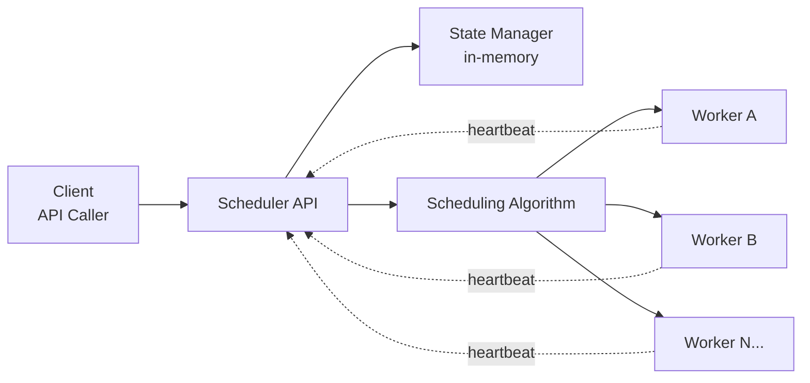
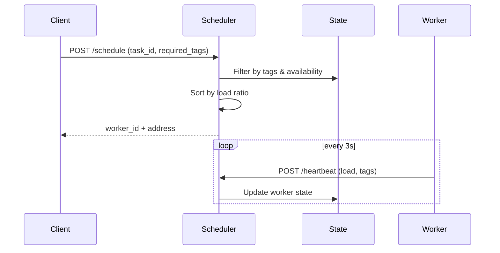

# dtask-scheduler

[](https://go.dev/)
[](LICENSE)
[](tests/)
[](tests/)

[English](README.md) | [简体中文](README_ZH.md)

A distributed CPU/GPU task scheduler for large-scale batch jobs across thousands of machines.

## Documentation Index

- Quick Start: [docs/quickstart.md](docs/quickstart.md)
- API Documentation: [docs/api.md](docs/api.md)
- Design Doc: [docs/plans/2025-12-14-distributed-scheduler-design.md](docs/plans/2025-12-14-distributed-scheduler-design.md)
- MVP Implementation: [docs/plans/2025-12-14-mvp-implementation.md](docs/plans/2025-12-14-mvp-implementation.md)

## Features

- **Zero dependencies**: No Redis, Kafka, or other middleware required
- **High performance**: Sub-millisecond scheduling latency (< 1ms)
- **Load balancing**: Automatic task distribution based on worker load
- **Resource matching**: Tag-based worker filtering (GPU, CPU, CUDA versions, etc.)
- **Simple deployment**: Single binary for scheduler and worker

## Performance Metrics

| Metric | Value | Description |
|--------|-------|-------------|
| **Scheduling Latency** | < 1ms | Time to assign task to worker |
| **Throughput** | 1000+ req/s | Scheduling requests per second |
| **Worker Scale** | 500+ machines | Tested worker pool size |
| **Heartbeat Overhead** | 33KB/s | Network bandwidth for 500 workers |
| **Memory Usage** | < 3MB | Scheduler memory footprint for 500 workers |
| **Timeout Detection** | 10s/20s | Suspicious/Offline thresholds |
| **Test Coverage** | 84-100% | Unit and integration test coverage |

## Status

| Component | Status | Description |
|-----------|--------|-------------|
| Core Scheduler | ✅ Production Ready | Single scheduler with in-memory state |
| Worker Agent | ✅ Production Ready | Heartbeat sender with graceful shutdown |
| Resource Filtering | ✅ Production Ready | Tag-based worker matching |
| Load Balancing | ✅ Production Ready | Load ratio-based selection |
| HTTP API | ✅ Production Ready | 3 endpoints with error handling |
| Integration Tests | ✅ Passing | 31 tests, 100% pass rate |
| High Availability | 🚧 Planned | Standby scheduler with failover |
| Monitoring | 🚧 Planned | Metrics and alerting |
| Tag Indexing | 🚧 Planned | Performance optimization |

## Architecture

```
Client → Scheduler → Worker Pool (500+ machines)
         ↑
         └─ Heartbeat (every 3s)
```

See the [Design Document](docs/plans/2025-12-14-distributed-scheduler-design.md) for details.

### Architecture (Mermaid)



### Scheduling Flow (Mermaid)



## Quick Start

For a full local/production guide, see [docs/quickstart.md](docs/quickstart.md).

### 0. Prerequisites

- Go 1.21+
- Network connectivity between scheduler and workers

### 1. Build

```bash
go build -o bin/scheduler ./cmd/scheduler
go build -o bin/worker ./cmd/worker
```

### 2. Start Scheduler

```bash
./bin/scheduler --port=8080
```

### 3. Start Workers

```bash
# GPU worker
./bin/worker --id=worker-001 --addr=localhost:9001 --tags=gpu,cuda-12.0 --max-tasks=30 --scheduler=http://localhost:8080

# CPU worker
./bin/worker --id=worker-002 --addr=localhost:9002 --tags=cpu,avx2 --max-tasks=30 --scheduler=http://localhost:8080
```

### 4. Schedule Task

```bash
curl -X POST http://localhost:8080/api/v1/schedule \
  -H "Content-Type: application/json" \
  -d '{"task_id":"task-001","required_tags":["gpu"]}'
```

Response:
```json
{
  "worker_id": "worker-001",
  "address": "localhost:9001"
}
```

### 5. List Workers

```bash
curl http://localhost:8080/api/v1/workers
```

## Runtime Flags

### scheduler

| Flag | Default | Description |
|------|---------|-------------|
| `--port` | `8080` | Listening port |

### worker

| Flag | Default | Description |
|------|---------|-------------|
| `--id` | `worker-001` | Worker ID |
| `--addr` | `localhost:9000` | Worker address (returned in scheduling result) |
| `--tags` | `cpu` | Resource tags, comma-separated |
| `--max-tasks` | `30` | Maximum concurrent tasks |
| `--scheduler` | `http://localhost:8080` | Scheduler base URL |

## API Overview

Base URL: `http://localhost:8080/api/v1`

- `POST /heartbeat`: Worker heartbeat
- `POST /schedule`: Schedule a task
- `GET /workers`: List workers

See [docs/api.md](docs/api.md) for details.

## Scheduling Algorithm

1. **Filter by tags**: Only workers with ALL required tags are considered
2. **Filter by availability**: Offline workers or workers at max capacity are excluded
3. **Sort by load ratio**: `load_ratio = current_tasks / max_tasks`
4. **Select lowest**: Worker with lowest load ratio is selected
5. **Optimistic allocation**: Task count incremented immediately (corrected by next heartbeat)

## Project Structure

```
dtask-scheduler/
├── cmd/
│   ├── scheduler/      # Scheduler entry
│   └── worker/         # Worker entry
├── internal/
│   ├── scheduler/      # Scheduler core logic
│   │   ├── algorithm.go   # Scheduling algorithm
│   │   ├── handlers.go    # HTTP handlers
│   │   └── state.go       # State manager
│   └── worker/         # Worker core logic
│       └── heartbeat.go   # Heartbeat sender
├── pkg/
│   └── types/          # Shared types
├── tests/              # Integration tests
└── docs/               # Documentation
```

## Development & Testing

```bash
# Unit tests
go test ./...

# Integration tests
go test ./tests -v
```

## Use Cases

- **Audio processing**: Large-scale transcoding, denoise, feature extraction
- **Video processing**: Transcoding, editing, AI enhancement
- **AI inference**: Dispatch model inference to GPU clusters
- **Data processing**: Batch data cleaning and transformation
- **Scientific computing**: Distributed computation scheduling

## Tech Stack

- **Language**: Go 1.21+
- **Dependencies**: Standard library only (net/http, encoding/json, sync, etc.)
- **Protocol**: HTTP/REST (heartbeat and scheduling API)
- **Concurrency**: goroutines + context + sync.RWMutex
- **Testing**: Standard testing + table-driven tests

## Roadmap

- [x] MVP: Single scheduler + heartbeat + basic scheduling
- [ ] High availability: Standby scheduler with failover
- [ ] Monitoring: Metrics and alerting
- [ ] Tag indexing: Faster resource filtering
- [ ] Queue: Wait queue for resource shortage
- [ ] Task priority: Preempting low-priority tasks
- [ ] Resource reservation: CPU/memory/GPU memory reservations

## Contributing

Issues and pull requests are welcome!

## License

MIT License - see [LICENSE](LICENSE) for details
