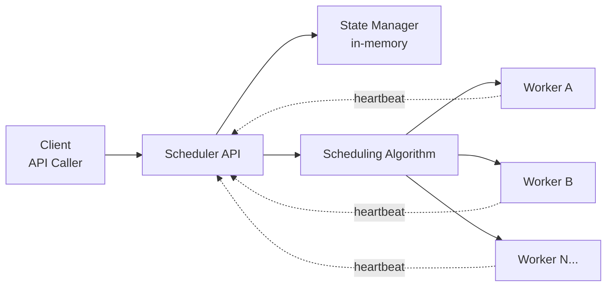
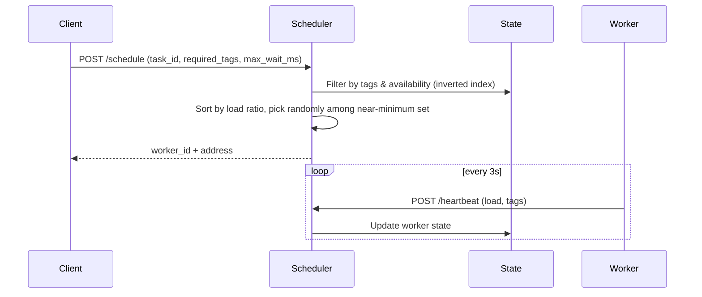

# dtask-scheduler

[](https://go.dev/)
[](LICENSE)
[](tests/)
[](tests/)

[English](README.md) | [简体中文](README_ZH.md)

A distributed CPU/GPU task scheduler for large-scale batch jobs across thousands of machines.

## Documentation Index

- Quick Start: [docs/quickstart.md](docs/quickstart.md)
- API Documentation: [docs/api.md](docs/api.md)
- Design Doc: [docs/plans/2025-12-14-distributed-scheduler-design.md](docs/plans/2025-12-14-distributed-scheduler-design.md)
- MVP Implementation: [docs/plans/2025-12-14-mvp-implementation.md](docs/plans/2025-12-14-mvp-implementation.md)

## Features

- **Zero dependencies**: No Redis, Kafka, or other middleware required
- **High performance**: Sub-millisecond scheduling latency (< 1ms)
- **Load balancing**: Automatic task distribution based on worker load with hot-spot spread
- **Resource matching**: Tag-based worker filtering (GPU, CPU, CUDA versions, etc.) via inverted index
- **Simple deployment**: Single binary for scheduler and worker
- **High availability**: Master/standby with automatic failover
- **Observability**: Prometheus metrics, liveness probe, and JSON stats endpoint
- **Wait queue**: Optional long-poll scheduling to absorb brief capacity spikes
- **Middleware**: Panic recovery, access logging, body size limit, and request ID on every handler

## Performance Metrics

| Metric | Value | Description |
|--------|-------|-------------|
| **Scheduling Latency** | < 1ms | Time to assign task to worker |
| **Throughput** | 1000+ req/s | Scheduling requests per second |
| **Worker Scale** | 500+ machines | Tested worker pool size |
| **Heartbeat Overhead** | 33KB/s | Network bandwidth for 500 workers |
| **Memory Usage** | < 3MB | Scheduler memory footprint for 500 workers |
| **Timeout Detection** | 10s/20s | Suspicious/Offline thresholds |
| **Test Coverage** | 88-100% | Unit and integration test coverage |

## Status

| Component | Status | Description |
|-----------|--------|-------------|
| Core Scheduler | ✅ Production Ready | Single scheduler with in-memory state |
| Worker Agent | ✅ Production Ready | Heartbeat sender with graceful shutdown |
| Resource Filtering | ✅ Production Ready | Tag-based worker matching |
| Load Balancing | ✅ Production Ready | Load ratio-based selection |
| HTTP API | ✅ Production Ready | 7 endpoints with error handling |
| Integration Tests | ✅ Passing | 167 tests, 100% pass rate |
| High Availability | ✅ Production Ready | Master/standby with automatic failover |
| Monitoring | ✅ Production Ready | Prometheus metrics, liveness probe, JSON stats |
| Tag Indexing | ✅ Production Ready | Inverted index for fast tag-set intersection |
| Wait Queue | ✅ Production Ready | Long-poll scheduling for capacity spikes |
| Middleware | ✅ Production Ready | Panic recovery, logging, size limit, request ID |

## Architecture

```
Client → Scheduler → Worker Pool (500+ machines)
         ↑
         └─ Heartbeat (every 3s)
```

See the [Design Document](docs/plans/2025-12-14-distributed-scheduler-design.md) for details.

### Architecture (Mermaid)


```mermaid
flowchart LR
    Client[Client\nAPI Caller] --> API[Scheduler API]
    API --> State[State Manager\nin-memory]
    API --> Algo[Scheduling Algorithm]
    Algo --> W1[Worker A]
    Algo --> W2[Worker B]
    Algo --> W3[Worker N...]
    W1 -.->|heartbeat| API
    W2 -.->|heartbeat| API
    W3 -.->|heartbeat| API
```

### Scheduling Flow (Mermaid)


```mermaid
sequenceDiagram
    participant Client
    participant Scheduler
    participant State
    participant Worker

    Client->>Scheduler: POST /schedule (task_id, required_tags, max_wait_ms)
    Scheduler->>State: Filter by tags & availability (inverted index)
    Scheduler->>Scheduler: Sort by load ratio, pick randomly among near-minimum set
    Scheduler-->>Client: worker_id + address

    loop every 3s
        Worker->>Scheduler: POST /heartbeat (load, tags)
        Scheduler->>State: Update worker state
    end
```

## Installation

```bash
go get github.com/chicogong/dtask-scheduler@v1.0.0
```

## Quick Start

For a full local/production guide, see [docs/quickstart.md](docs/quickstart.md).

### 0. Prerequisites

- Go 1.21+
- Network connectivity between scheduler and workers

### 1. Build

```bash
go build -o bin/scheduler ./cmd/scheduler
go build -o bin/worker ./cmd/worker
```

### 2. Start Scheduler

```bash
./bin/scheduler --port=8080
```

### 3. Start Workers

```bash
# GPU worker
./bin/worker --id=worker-001 --addr=localhost:9001 --tags=gpu,cuda-12.0 --max-tasks=30 --scheduler=http://localhost:8080

# CPU worker
./bin/worker --id=worker-002 --addr=localhost:9002 --tags=cpu,avx2 --max-tasks=30 --scheduler=http://localhost:8080
```

### 4. Schedule Task

```bash
curl -X POST http://localhost:8080/api/v1/schedule \
  -H "Content-Type: application/json" \
  -d '{"task_id":"task-001","required_tags":["gpu"]}'
```

Response:
```json
{
  "worker_id": "worker-001",
  "address": "localhost:9001"
}
```

### 5. List Workers

```bash
curl http://localhost:8080/api/v1/workers
```

## Library Usage

### Using as a Library

You can embed the scheduler or worker in your Go application:

**Embedding the Scheduler:**

```go
import (
    "context"
    "net/http"
    "time"
    "github.com/chicogong/dtask-scheduler/pkg/scheduler"
)

// Create state manager and handler
state := scheduler.NewStateManager()
handler := scheduler.NewHandler(state)

// Setup HTTP routes
mux := http.NewServeMux()
mux.HandleFunc("/api/v1/heartbeat", handler.HandleHeartbeat)
mux.HandleFunc("/api/v1/schedule", handler.HandleSchedule)
mux.HandleFunc("/api/v1/workers", handler.HandleListWorkers)

// Start background timeout checker
ctx, cancel := context.WithCancel(context.Background())
defer cancel()
go func() {
    ticker := time.NewTicker(5 * time.Second)
    defer ticker.Stop()
    for {
        select {
        case <-ticker.C:
            state.CheckTimeouts()
        case <-ctx.Done():
            return
        }
    }
}()

// Start server
http.ListenAndServe(":8080", mux)
```

**Embedding a Worker:**

```go
import (
    "context"
    "github.com/chicogong/dtask-scheduler/pkg/worker"
)

// Create and start heartbeat sender
sender := worker.NewHeartbeatSender(
    "worker-001",
    "localhost:9001",
    []string{"gpu", "cuda-12.0"},
    30,
    "http://localhost:8080",
)

ctx := context.Background()
go sender.Start(ctx)

// Update task count as needed
sender.UpdateTaskCount(15)
```

**Using the Client Library:**

```go
import (
    "context"
    "github.com/chicogong/dtask-scheduler/pkg/client"
    "github.com/chicogong/dtask-scheduler/pkg/types"
)

// Create client
c := client.NewClient("http://localhost:8080")

// Schedule a task
resp, err := c.Schedule(context.Background(), &types.ScheduleRequest{
    TaskID:       "task-001",
    RequiredTags: []string{"gpu"},
})
if err != nil {
    // Handle error
}

// Use worker info
println("Scheduled to:", resp.WorkerID, resp.Address)

// List all workers
workers, err := c.ListWorkers(context.Background())

// Check scheduler liveness
err = c.Health(context.Background())
```

**Using Types:**

```go
import "github.com/chicogong/dtask-scheduler/pkg/types"

req := &types.ScheduleRequest{
    TaskID:       "task-001",
    RequiredTags: []string{"gpu"},
}
```

## Runtime Flags

### scheduler

| Flag | Default | Description |
|------|---------|-------------|
| `--port` | `8080` | Listening port |
| `--role` | `master` | Scheduler role: `master` or `standby` |
| `--peer` | (empty) | Peer scheduler base URL (master replicates to it; standby health-checks it) |
| `--replication-interval` | `2s` | How often the master replicates worker state to the standby |
| `--failover-interval` | `2s` | How often the standby health-checks the master |
| `--failover-threshold` | `3` | Consecutive failed health checks before the standby self-promotes |
| `--suspicious-threshold` | `10s` | Heartbeat age before a worker is marked suspicious |
| `--offline-threshold` | `20s` | Heartbeat age before a worker is marked offline |
| `--timeout-check-interval` | `5s` | How often the scheduler scans for stale workers |
| `--max-body-bytes` | `1048576` | Maximum accepted request body size, in bytes |

### worker

| Flag | Default | Description |
|------|---------|-------------|
| `--id` | `worker-001` | Worker ID |
| `--addr` | `localhost:9000` | Worker address (returned in scheduling result) |
| `--tags` | `cpu` | Resource tags, comma-separated |
| `--max-tasks` | `30` | Maximum concurrent tasks |
| `--scheduler` | `http://localhost:8080` | Scheduler base URL |
| `--standby` | (empty) | Standby scheduler URL; when set, heartbeats are dual-sent here as well |

## API Overview

Base URL: `http://localhost:8080/api/v1`

- `POST /heartbeat`: Worker heartbeat
- `POST /schedule`: Schedule a task (optional `max_wait_ms` for long-poll)
- `GET /workers`: List workers
- `POST /api/v1/sync`: Internal replication endpoint (standby only)

Observability endpoints (root path, no `/api/v1` prefix):

- `GET /healthz`: Liveness probe — returns `{"status":"ok"}`
- `GET /metrics`: Prometheus text metrics
- `GET /stats`: JSON aggregate of worker counts, capacity, and scheduling counters

See [docs/api.md](docs/api.md) for details.

## Scheduling Algorithm

1. **Filter by tags**: A tag inverted index intersects the candidate sets of the required tags, so filtering scales with the number of matching workers instead of the whole pool
2. **Filter by availability**: Offline workers or workers at max capacity are excluded
3. **Sort by load ratio**: `load_ratio = current_tasks / max_tasks`
4. **Spread**: All workers whose load ratio is within 0.05 of the minimum form a candidate set; one is chosen at random to avoid hot-spotting
5. **Optimistic allocation**: Task count incremented immediately (corrected by next heartbeat)
6. **Wait queue (optional)**: If `max_wait_ms > 0` in the request and no worker is available, the scheduler blocks up to that many milliseconds (hard cap: 60000ms) for a worker to free capacity before returning 503

## Project Structure

```
dtask-scheduler/
├── cmd/
│   ├── scheduler/      # scheduler entrypoint
│   └── worker/         # worker entrypoint
├── pkg/
│   ├── types/          # shared data structures
│   ├── scheduler/      # core scheduling: state, algorithm, HTTP handlers, tag index, wait queue, config
│   ├── worker/         # worker heartbeat agent
│   ├── client/         # Go HTTP client library
│   ├── observability/  # metrics collector + /healthz, /metrics, /stats endpoints
│   ├── ha/             # master/standby replication + failover
│   └── middleware/     # composable HTTP middleware
├── tests/              # integration tests
└── docs/               # documentation
```

## Development & Testing

```bash
# Unit tests
go test ./...

# Integration tests
go test ./tests -v
```

## Use Cases

- **Audio processing**: Large-scale transcoding, denoise, feature extraction
- **Video processing**: Transcoding, editing, AI enhancement
- **AI inference**: Dispatch model inference to GPU clusters
- **Data processing**: Batch data cleaning and transformation
- **Scientific computing**: Distributed computation scheduling

## Tech Stack

- **Language**: Go 1.21+
- **Dependencies**: Standard library only (net/http, encoding/json, sync, etc.)
- **Protocol**: HTTP/REST (heartbeat and scheduling API)
- **Concurrency**: goroutines + context + sync.RWMutex
- **Testing**: Standard testing + table-driven tests

## Roadmap

- [x] MVP: Single scheduler + heartbeat + basic scheduling
- [x] High availability: Master/standby with automatic failover
- [x] Monitoring: Prometheus metrics, liveness probe, JSON stats
- [x] Tag indexing: Inverted index for fast resource filtering
- [x] Wait queue: Long-poll scheduling for brief capacity spikes
- [ ] Task priority: Preempting low-priority tasks
- [ ] Resource reservation: CPU/memory/GPU memory reservations

## Contributing

Issues and pull requests are welcome!

## License

MIT License - see [LICENSE](LICENSE) for details
