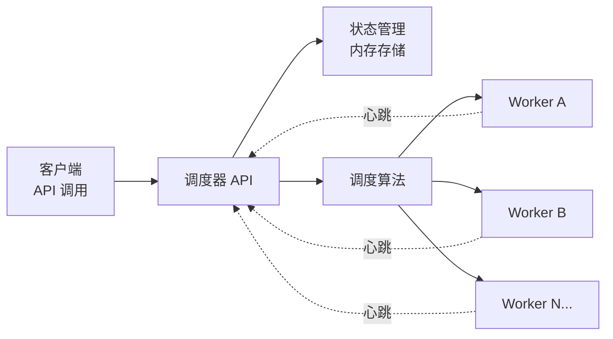
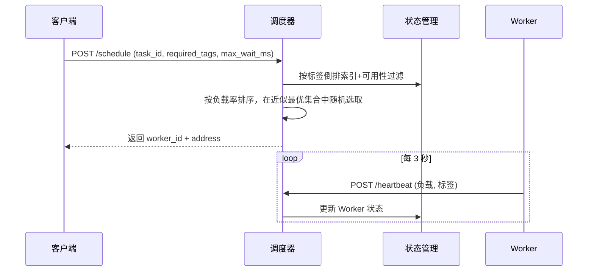

# dtask-scheduler

[](https://go.dev/)
[](LICENSE)
[](tests/)
[](tests/)

[English](README.md) | [简体中文](README_ZH.md)

一个面向大规模批处理任务的分布式 CPU/GPU 任务调度器,支持跨数千台机器的统一调度。

## 文档索引

- 快速开始: [docs/quickstart_zh.md](docs/quickstart_zh.md)
- API 文档: [docs/api_zh.md](docs/api_zh.md)
- 设计文档: [docs/plans/2025-12-14-distributed-scheduler-design.md](docs/plans/2025-12-14-distributed-scheduler-design.md)
- MVP 实现: [docs/plans/2025-12-14-mvp-implementation.md](docs/plans/2025-12-14-mvp-implementation.md)

## 特性

- **零依赖**: 无需 Redis、Kafka 等第三方中间件
- **高性能**: 亚毫秒级调度延迟 (< 1ms)
- **负载均衡**: 基于 Worker 负载自动分配任务，含热点分散策略
- **资源匹配**: 基于标签倒排索引的 Worker 过滤 (GPU、CPU、CUDA 版本等)
- **简单部署**: 调度器和 Worker 各一个独立二进制文件
- **高可用**: 主备调度器 + 自动故障切换
- **可观测性**: Prometheus 指标、存活探针、JSON 统计端点
- **等待队列**: 可选长轮询调度，应对短暂容量不足
- **中间件**: 每个处理器均有 panic 恢复、访问日志、请求体限制和请求 ID

## 性能指标

| 指标 | 数值 | 说明 |
|------|------|------|
| **调度延迟** | < 1ms | 任务分配给 Worker 的时间 |
| **吞吐量** | 1000+ 请求/秒 | 每秒可处理的调度请求数 |
| **Worker 规模** | 500+ 台 | 已测试的 Worker 集群规模 |
| **心跳开销** | 33KB/秒 | 500 台 Worker 的网络带宽消耗 |
| **内存占用** | < 3MB | 调度器管理 500 台 Worker 的内存占用 |
| **超时检测** | 10秒/20秒 | 可疑/离线状态判定阈值 |
| **测试覆盖率** | 88-100% | 单元测试和集成测试覆盖率 |

## 功能状态

| 组件 | 状态 | 说明 |
|------|------|------|
| 核心调度器 | ✅ 生产可用 | 单调度器 + 内存状态管理 |
| Worker 代理 | ✅ 生产可用 | 心跳发送器 + 优雅关闭 |
| 资源过滤 | ✅ 生产可用 | 基于标签的 Worker 匹配 |
| 负载均衡 | ✅ 生产可用 | 基于负载率的选择算法 |
| HTTP API | ✅ 生产可用 | 7个端点 + 完整错误处理 |
| 集成测试 | ✅ 通过 | 170个测试，100% 通过率 |
| 高可用 | ✅ 生产可用 | 主备调度器 + 自动故障切换 |
| 监控 | ✅ 生产可用 | Prometheus 指标、存活探针、JSON 统计 |
| 标签索引 | ✅ 生产可用 | 倒排索引，快速标签交集 |
| 等待队列 | ✅ 生产可用 | 长轮询调度，应对短暂容量不足 |
| 中间件 | ✅ 生产可用 | panic 恢复、访问日志、请求体限制、请求 ID |

## 架构

```
客户端 → 调度器 → Worker 集群 (500+ 台机器)
         ↑
         └─ 心跳 (每3秒)
```

详见[设计文档](docs/plans/2025-12-14-distributed-scheduler-design.md)。

### 架构图 (Mermaid)



### 调度流程 (Mermaid)



## 快速开始

更完整的部署、监控与排障说明见 [docs/quickstart_zh.md](docs/quickstart_zh.md)。

### 0. 环境

- Go 1.21+
- 调度器与 Worker 网络可达

### 1. 构建

```bash
go build -o bin/scheduler ./cmd/scheduler
go build -o bin/worker ./cmd/worker
```

### 2. 启动调度器

```bash
./bin/scheduler --port=8080
```

### 3. 启动 Worker

```bash
# GPU Worker
./bin/worker --id=worker-001 --addr=localhost:9001 --tags=gpu,cuda-12.0 --max-tasks=30 --scheduler=http://localhost:8080

# CPU Worker
./bin/worker --id=worker-002 --addr=localhost:9002 --tags=cpu,avx2 --max-tasks=30 --scheduler=http://localhost:8080
```

### 4. 调度任务

```bash
curl -X POST http://localhost:8080/api/v1/schedule \
  -H "Content-Type: application/json" \
  -d '{"task_id":"task-001","required_tags":["gpu"]}'
```

响应:
```json
{
  "worker_id": "worker-001",
  "address": "localhost:9001"
}
```

### 5. 查看 Worker

```bash
curl http://localhost:8080/api/v1/workers
```

## 运行参数

### scheduler

| 参数 | 默认值 | 说明 |
|------|--------|------|
| `--port` | `8080` | 监听端口 |
| `--role` | `master` | 调度器角色：`master` 或 `standby` |
| `--peer` | (空) | 对端调度器地址（主节点向其同步；备节点对其健康检查）|
| `--replication-interval` | `2s` | 主节点同步 Worker 状态到备节点的间隔 |
| `--failover-interval` | `2s` | 备节点对主节点进行健康检查的间隔 |
| `--failover-threshold` | `3` | 连续健康检查失败次数达到此值后备节点自动晋升 |
| `--suspicious-threshold` | `10s` | Worker 心跳超过此时间后被标记为 suspicious |
| `--offline-threshold` | `20s` | Worker 心跳超过此时间后被标记为 offline |
| `--timeout-check-interval` | `5s` | 调度器扫描过期 Worker 的间隔 |
| `--max-body-bytes` | `1048576` | 请求体最大字节数 |

### worker

| 参数 | 默认值 | 说明 |
|------|--------|------|
| `--id` | `worker-001` | Worker ID |
| `--addr` | `localhost:9000` | Worker 对外地址 (调度结果返回此值) |
| `--tags` | `cpu` | 资源标签，逗号分隔 |
| `--max-tasks` | `30` | 最大并发任务数 |
| `--scheduler` | `http://localhost:8080` | 调度器地址 |
| `--standby` | (空) | 备用调度器地址；设置后心跳将同时发送到此地址 |

## API 文档

基地址: `http://localhost:8080/api/v1`

- `POST /heartbeat`: Worker 心跳
- `POST /schedule`: 调度任务（可选 `max_wait_ms` 字段支持长轮询）
- `GET /workers`: 列出 Worker
- `POST /api/v1/sync`: 内部同步端点（仅备节点接受）

可观测性端点（根路径，无 `/api/v1` 前缀）：

- `GET /healthz`: 存活探针 — 返回 `{"status":"ok"}`
- `GET /metrics`: Prometheus 文本格式指标
- `GET /stats`: Worker 数量、容量、调度统计的 JSON 汇总

详见 [API 文档](docs/api_zh.md)。

## 调度算法

1. **资源标签过滤**: 利用标签倒排索引对所有必需标签取交集，过滤开销只与匹配的 Worker 数量相关，而非整个集群规模
2. **可用性过滤**: 排除离线或满载的 Worker
3. **负载排序**: 按负载率 (当前任务数/最大任务数) 升序排序
4. **热点分散**: 负载率在最小值 0.05 以内的 Worker 组成候选集，随机选取其中一个，避免任务堆积到单一节点
5. **乐观分配**: 立即增加任务计数，由下次心跳校正
6. **等待队列（可选）**: 若请求中 `max_wait_ms > 0` 且当前无可用 Worker，调度器将最多阻塞该毫秒数（上限 60000ms）等待 Worker 释放容量，否则立即返回 503

## 项目结构

```
dtask-scheduler/
├── cmd/
│   ├── scheduler/      # scheduler entrypoint
│   └── worker/         # worker entrypoint
├── pkg/
│   ├── types/          # shared data structures
│   ├── scheduler/      # core scheduling: state, algorithm, HTTP handlers, tag index, wait queue, config
│   ├── worker/         # worker heartbeat agent
│   ├── client/         # Go HTTP client library
│   ├── observability/  # metrics collector + /healthz, /metrics, /stats endpoints
│   ├── ha/             # master/standby replication + failover
│   └── middleware/     # composable HTTP middleware
├── tests/              # integration tests
└── docs/               # documentation
```

## 开发与测试

```bash
# 单元测试
go test ./...

# 集成测试
go test ./tests -v
```

## 使用场景

- **音频处理**: 大规模音频转码、降噪、特征提取
- **视频处理**: 视频转码、剪辑、AI 增强
- **AI 推理**: 模型推理任务分发到 GPU 集群
- **数据处理**: 大批量数据清洗、转换任务
- **科学计算**: 分布式计算任务调度

## 技术栈

- **语言**: Go 1.21+
- **依赖**: 仅标准库 (net/http, encoding/json, sync 等)
- **协议**: HTTP/REST (heartbeat 和 scheduling API)
- **并发**: goroutines + context + sync.RWMutex
- **测试**: 标准 testing 包 + table-driven tests

## 开发路线图

- [x] **MVP**: 单调度器 + 心跳机制 + 基础调度
- [x] **高可用**: 主备调度器 + 自动故障切换
- [x] **监控**: Prometheus 指标、存活探针、JSON 统计
- [x] **标签索引**: 倒排索引加速资源过滤
- [x] **等待队列**: 长轮询调度，应对短暂容量不足
- [ ] **任务优先级**: 支持高优先级任务插队
- [ ] **资源预留**: 细粒度的 CPU/内存/GPU 显存预留

## 贡献

欢迎提交 Issue 和 Pull Request!

## 许可证

MIT License - 详见 [LICENSE](LICENSE) 文件
